# What makes GoodNotes feel smooth, and what GoodObsidian is missing

Study of GoodNotes' editor, 2026-09-24/25. **Scope:** only the smoothness details that
GoodObsidian does not have yet, each checked for feasibility in an Obsidian plugin on iPad.
Features are out of scope, and so is the library/dashboard.

- **Source:** GoodNotes **web** (web.goodnotes.com). It is a web app, so everything below
  is known to be buildable with web technology, which makes it a fair stand-in for
  Obsidian's WKWebView. The iPad app may differ in places.
- **Measured:** timings come from recording element positions every frame at 61 fps, and
  from logging CSS transitions. Two viewports were used: 852×722 (close to an iPad in
  portrait) and 1536×770. Anything marked "seen" was observed on screen but not timed.
- **Compared against:** GoodObsidian 0.7.3 plus the uncommitted work in the tree on
  2026-09-24. Code references are file:line as of that date.
- **Images:** the `img/NN-*.png` files are GoodNotes screenshots. The `img/d*.svg` files are
  diagrams drawn from the measurements.

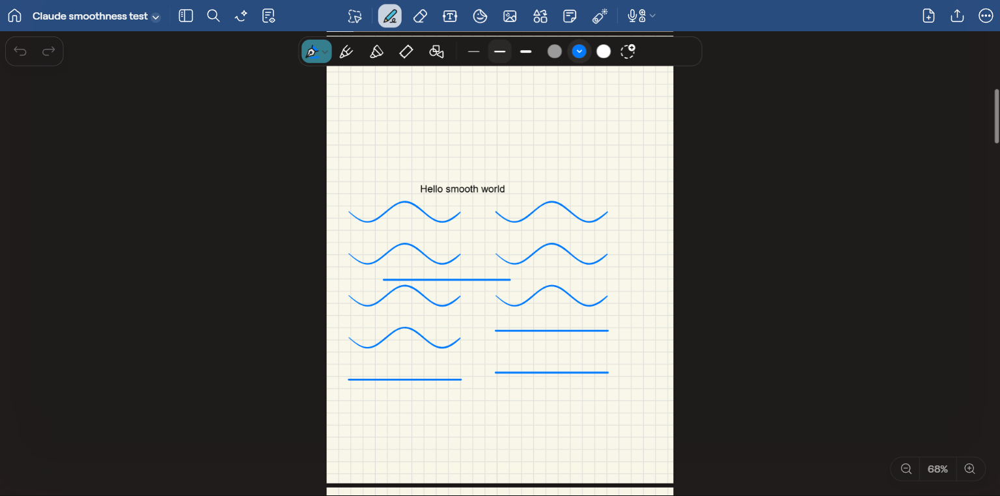

## Summary: what to build, in order

| #   | Change                                                         | GoodObsidian today                      | iPad feasibility                   | Effort |
| --- | -------------------------------------------------------------- | --------------------------------------- | ---------------------------------- | ------ |
| 1   | Reopen a notebook on the page you left, at fit zoom            | always page 1                           | easy                               | S      |
| 2   | Page counter, zoom % and scroll thumbs only while moving       | counter always on; no zoom %, no thumbs | easy                               | S      |
| 3   | Glide to every page jump (thumbnail, add page, PgUp/PgDn)      | instant                                 | easy (the glide exists)            | S      |
| 4   | Undo/redo: disable when empty, glide to off-screen changes     | never disabled, silent                  | easy; **beats GoodNotes**          | S–M    |
| 5   | Sidebar slides; the page moves while the canvas keeps its size | `display:none` + re-layout              | medium (avoid canvas resizes)      | M      |
| 6   | Toolbar motion: press squish, widen-with-▾, options width      | instant rebuild                         | easy (CSS + one data attribute)    | S      |
| 7   | Text box: first tap outside keeps it selected                  | deselects at once                       | medium                             | M      |
| 8   | Lasso outline follows the loop, smoothed                       | raw path, then a rectangle              | easy                               | S      |
| 9   | Tap the selected colour again to edit it (▾ hint)              | separate "More colours" button          | easy                               | S      |
| 10  | Stroke width shown in mm, wedge slider, reset                  | no units                                | easy                               | S      |
| 11  | Copy link to page, arrow-key scroll, off-page notice           | missing                                 | easy                               | S      |
| 12  | Frosted floating controls                                      | opaque                                  | easy to write; test the frame rate | S      |

**Status, 2026-09-25: all twelve are built** (commits `dc5e6e1` to `b226be2`, listed under
`[Unreleased]` in CHANGELOG.md) and checked in a browser harness running the real
`InkSurface` and `Toolbar`. Still to check on the iPad itself: the frame rate with the
frost on (§12), and that the press feedback reads under a Pencil tap (§6). Two choices
differ from GoodNotes on purpose: a stroke off the page is kept rather than dropped (§11),
and the ▾ only appears on the lasso, the one tool whose second tap opens a menu (§6).

---

## 1. Come back where you left off

**GoodNotes (measured).**

- Reopening a notebook returns to **the same page**, but **resets zoom to fit-page**,
  with that page's top aligned under the toolbar.
- The last tool is remembered. The page sidebar always opens closed. Undo history
  starts empty.
- On open, the page counter and zoom % flash once, then fade (see §2), so you know
  where you are.
- The URL follows the page (`#page-2`), updated with `replaceState`, so the history
  never fills up with pages.

**GoodObsidian today.** Nothing is remembered: every open starts at page 1 at the
fit floor. The view has no `getState`/`getEphemeralState`. Page links already work
(`#page=3`, [ink-view.ts:1014](../../src/view/ink-view.ts#L1014); jump at
[ink-view.ts:1039](../../src/view/ink-view.ts#L1039)).

**On iPad in Obsidian: easy.**

- Store `{pageId, index}` per notebook path with `app.saveLocalStorage`. It is
  vault-scoped and per device, and `minAppVersion` is already 1.8.7. The recent-templates
  list uses the same mechanism
  ([ink-view.ts:1648](../../src/view/ink-view.ts#L1648)).
- Re-key the entry on `vault.on("rename")`.
- Restore through the same path the deep link uses, after first layout. An explicit
  `#page=N` subpath wins.
- Remember the **page**, not the scroll offset. This follows the ledger rule against
  saving coordinates that depend on the viewport, and a different device gets the same
  page at its own fit zoom.
- Also implement `getEphemeralState()` returning `{ page }`. Obsidian calls it when you
  navigate away and hands it back to `setEphemeralState` on Back/Forward, so history
  navigation remembers the page too.

---

## 2. Page counter, zoom % and scroll thumbs appear only while you move

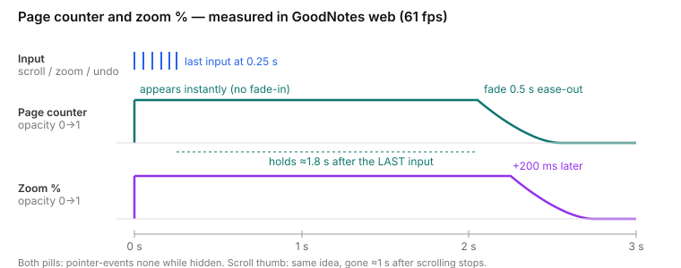

**GoodNotes (measured).**

- Three pieces of on-screen information appear **instantly** on the first input: the
  page counter "2 of 8" (bottom-left), a zoom pill "⊖ 68% ⊕" (bottom-right) and thin
  scroll thumbs. The triggers are scroll, zoom, open, undo, a page jump, adding a page
  and finishing a text box.
- They stay while input continues, then **hold ≈1.8 s after the last input**, then
  fade over **0.5 s ease-out**. The zoom pill fades **200 ms after** the counter. The
  scroll thumb is gone about 1 s after scrolling stops.
- While hidden they have `pointer-events: none`, so they can't catch a stray tap.
- During a zoom rubber-band the % label keeps showing the overshoot ("1020%") and jumps
  to the limit ("800%") when the spring settles.
- The counter follows the canvas area: when the sidebar is open it sits right of the
  panel.

| Page counter and horizontal thumb (zoomed in) | Zoom pill                 | Vertical thumb               |
| --------------------------------------------- | ------------------------- | ---------------------------- |
| 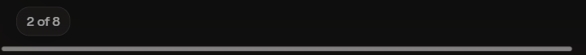    |  |  |

**GoodObsidian today.**

- The "N / M" pill is always visible at 0.85 opacity
  ([styles.css:934](../../styles.css#L934)). Its text updates on every viewport sync
  ([ink-surface.ts:1677](../../src/view/ink-surface.ts#L1677)).
- There's no zoom readout: the toolbar zoom buttons were removed on purpose
  ([toolbar.ts:28](../../src/view/toolbar.ts#L28)).
- There are no scroll thumbs, because the paper moves by `transform`, so the browser
  draws none.

**On iPad in Obsidian: easy.**

- Opacity transitions run on the compositor in WebKit and cost almost nothing.
- **Build it this way:**
  - In `updatePageIndicator()`, remove an `is-idle` class and restart a 1.8 s timer that
    adds it back.
  - `.goodobsidian-pageindicator { transition: opacity .5s ease-out }` with
    `.is-idle { opacity: 0 }`. `pointer-events: none` is already there.
  - Add a zoom pill built the same way, driven by pinch, Ctrl+wheel and the zoom spring,
    with a 200 ms later hide. If you keep its ± buttons, make them 44 px targets.
  - Thumbs: two absolutely positioned 3 px bars sized from `scroller.position` and the
    content size. Show the horizontal one only when zoomed past fit-width.
- **iPad caveats:**
  - Time the fade with a timer, not with "no events for N ms". Your ledger already says
    so ("the absence of events is exactly the case being detected").
  - The counter moves to bottom-left in GoodNotes, a spot the palm rests on less.
    GoodObsidian's bottom-centre spot was chosen for the palm too, so keep it.

---

## 3. Every page jump glides, and always takes the same time

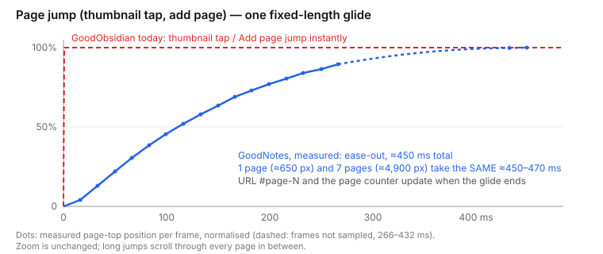

**GoodNotes (measured).**

- Thumbnail taps and "Add page (After)" glide with an **ease-out of ≈450 ms**.
- A 7-page jump (~4,900 px) took **the same ≈470 ms** as a 1-page jump, passing
  through every page in between.
- Zoom is unchanged. The URL and page counter update when the glide ends.
- The thumbnail list scrolls itself to keep the current page in view. GoodObsidian
  already does this.

**GoodObsidian today.**

- `goToPage(index, animate)` can glide on the scroll spring
  ([ink-surface.ts:1334](../../src/view/ink-surface.ts#L1334)), but most callers pass no
  `animate`:
  - thumbnail tap: [ink-view.ts:811](../../src/view/ink-view.ts#L811)
  - Add page: [ink-view.ts:854](../../src/view/ink-view.ts#L854) and
    [ink-view.ts:1390](../../src/view/ink-view.ts#L1390)
  - PgUp/PgDn: [ink-surface.ts:1362](../../src/view/ink-surface.ts#L1362)
- Only pull-to-add and search results glide.

**On iPad in Obsidian: easy.**

- Pass `animate: true` at those call sites. That's the smallest change.
- For GoodNotes' feel, use a **fixed-duration ease-out (≈450 ms)** instead of the spring
  for jumps. A critically damped spring (ω = 0.018/ms) starts from zero velocity, so it
  feels slow off the mark, and it needs about 600 ms to settle over 4,900 px.
- The renderer already copes: while `isTransient` it rasterises no tiles and draws the
  stand-ins, which is exactly what a fast pass over several pages needs.
- At 60 Hz, 450 ms is 27 frames.

---

## 4. Undo that shows you what it undid (a chance to beat GoodNotes)

**GoodNotes (measured).**

- Ctrl+Z works, and the buttons dim when there's nothing to undo or redo.
- But **undoing a change on an off-screen page doesn't scroll there.** Only the page
  counter flashes and the page's thumbnail changes, so you can't see what happened.

**GoodObsidian today.**

- Also silent: undo only repaints
  ([ink-surface.ts:5412](../../src/view/ink-surface.ts#L5412)).
- The buttons are never disabled: `canUndo()`/`canRedo()` exist but have no callers
  ([history.ts:59](../../src/model/history.ts#L59)). A disabled style is ready at
  [styles.css:113](../../styles.css#L113).

**On iPad in Obsidian: easy to medium.**

- Wire `canUndo`/`canRedo` to the toolbar after every command.
- Page-addressed commands ([page-commands.ts](../../src/model/page-commands.ts)) know
  their page id. After undo or redo, if that page isn't in view, glide to it (§3), then
  flash the page counter (§2).
- Nothing here depends on the platform.

---

## 5. Sidebar: the panel slides, the page moves, the canvas keeps its size

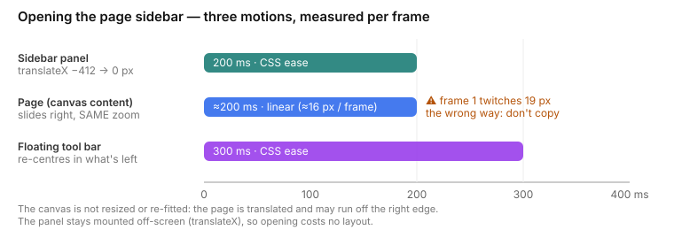

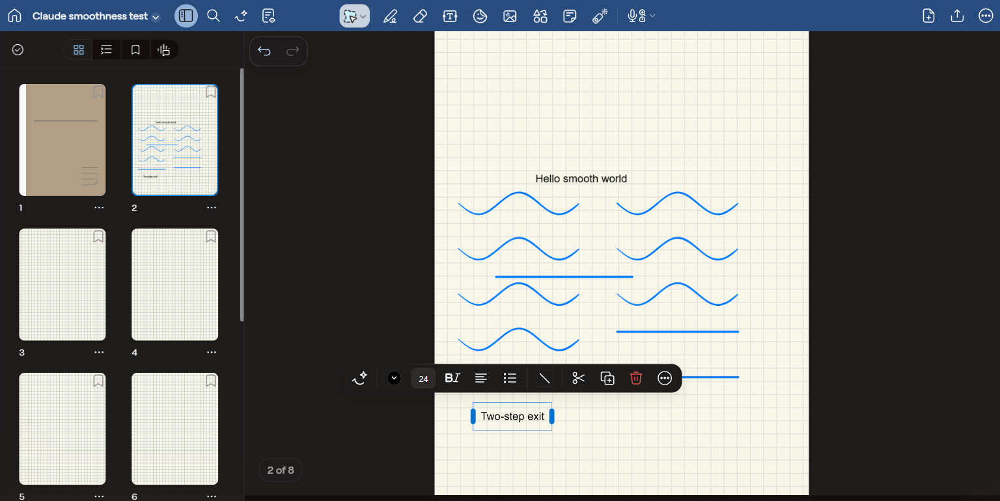

**GoodNotes (measured per frame).**

- **The panel** slides in with `translateX(-412px → 0)` over **200 ms, CSS `ease`**. It
  stays mounted off-screen, so opening costs no layout work.
- **The page** is translated right over about 200 ms at a **constant ~16 px per frame**.
  Zoom and canvas size don't change, and the page may run off the right edge.
- **The floating tool bar** re-centres in the remaining width over **300 ms `ease`**, and
  gets ‹ › scroll arrows when it no longer fits.
- **Current page:** blue outline, number bottom-left, "…" menu bottom-right. Thumbnails
  update live.
- One flaw not to copy: on the first frame the page twitches 19 px the wrong way.

**GoodObsidian today.**

- The panel appears and disappears with `display: none`
  ([styles.css:485](../../styles.css#L485)).
- Then the surface narrows and lays out again in the same frame
  ([ink-view.ts:1150](../../src/view/ink-view.ts#L1150)). This is correct, but not
  animated.

**On iPad in Obsidian: medium.**

- **The trap:** animating the surface's _width_ would resize the canvas every frame, and
  re-allocating a canvas backing store 12 times in 200 ms is exactly what drops frames on
  an iPad.
- **Do what GoodNotes does:**
  1. Keep the panel in the layout; slide it with a CSS transform over 200 ms.
  2. At the same time, animate the paper's `translate` (already the page's positioning
     mechanism, [ink-surface.ts:1674](../../src/view/ink-surface.ts#L1674)) to where the
     page will sit.
  3. Call `layout()` **once** on `transitionend`.
- Use the same easing on both motions: GoodNotes pairs `ease` with linear, which is why
  it looks slightly off.
- At 600 px or less the panel already overlays the page, and that case only needs the
  slide.

---

## 6. Toolbar motion and press feedback

| Selected tool widens to show its ▾                | Options bar (pen): selected swatch shows ▾ |
| ------------------------------------------------- | ------------------------------------------ |
|  | 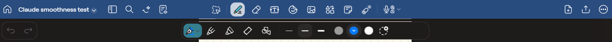       |

**GoodNotes (measured).**

- **Press:** the button's background square shrinks to `scale(0.833)` over 0.3 s `ease`
  and springs back on release. The background colour changes in 0.15 s. The pressed
  state is a **data attribute set from JS** (`[data-left-active]`), not `:active`.
- **Selected tool:** the button widens (`width` and `padding`, 0.3 s `ease`) and a ▾
  fades in (`max-width` + `opacity`, 0.3 s). That makes its sub-menu discoverable
  without taking permanent space.
- **Switching tools:** the options bar swaps its contents, changes width and stays
  centred.
- **Menus:** the selection and text menus fade in over 0.16 s `ease-out`. Tooltips need
  a hover, so they don't apply to the iPad.

**GoodObsidian today.**

- The options bar is emptied and rebuilt instantly; hiding it uses `display: none`
  ([toolbar.ts:545](../../src/view/toolbar.ts#L545),
  [styles.css:152](../../styles.css#L152)).
- There's no pressed-state feedback.

**On iPad in Obsidian: easy.**

- WebKit on iOS only applies `:active` when the page has a touch listener, and the
  ledger says Pencil taps on controls over the page are driven by `pointerdown`/`pointerup`
  anyway. So set `data-pressed` on `pointerdown` and clear it on
  `pointerup`/`pointercancel`, exactly like GoodNotes.
- Keep `clickable-icon` on the buttons (ledger: Obsidian restyles plain buttons).
- Animating `width` on one small bar is cheap.
- To animate the options bar between two contents: measure the new width, transition
  it, and cross-fade the contents over about 150 ms.

---

## 7. Text box: the first tap outside keeps it selected

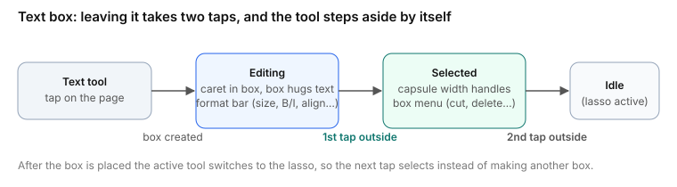

| Editing (format bar flips above near the page bottom) | After the first tap outside: selected                      |
| ----------------------------------------------------- | ---------------------------------------------------------- |
| 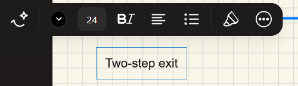                     | 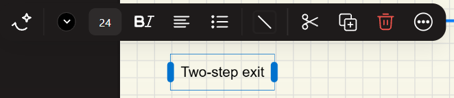 |

**GoodNotes (seen).**

- A tap with the text tool creates a box that's already in editing mode. The box grows
  to fit its text, and the tool switches to the lasso on its own.
- The **first tap outside** stops typing but leaves the box **selected**: capsule width
  handles, and a menu for the whole box (cut, duplicate, delete, …). You can move or
  resize the box right after typing.
- The **second tap** deselects it.

**GoodObsidian today.** A tap outside finishes the box on lift, and nothing stays
selected ([ink-surface.ts:2540](../../src/view/ink-surface.ts#L2540)).

**On iPad in Obsidian: medium.**

- The first tap blurs the box, which also dismisses the keyboard, and this matters on
  iPad: the page gets its full height back (your `--keyboard-height` work) while the box
  stays adjustable.
- It needs a "text box selected, not editing" state that reuses the selection bar
  ([selection-bar.ts](../../src/view/selection-bar.ts)).

---

## 8. The lasso outline follows your loop, smoothed

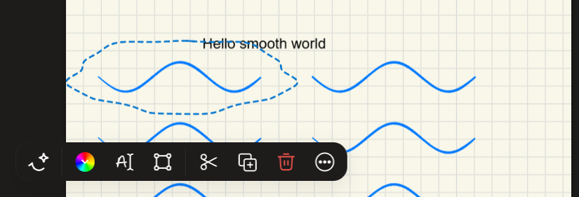

**GoodNotes (seen).**

- The dashed accent-blue outline is **your own loop with its corners rounded off**. It
  isn't replaced by a rectangle or a hull: a wobbly ellipse stays wobbly, and a drawn
  rectangle becomes a stadium shape.
- The selection keeps that outline.
- The menu fades in 0.16 s below or above, depending on room, and hides while you drag.
  GoodObsidian already does both.

**GoodObsidian today.**

- The outline is drawn from the raw points
  ([lasso.ts:110](../../src/canvas/lasso.ts#L110),
  [renderer.ts:939](../../src/canvas/renderer.ts#L939)).
- After selecting, it becomes a dashed **rectangle**
  ([ink-surface.ts:4162](../../src/view/ink-surface.ts#L4162)).

**On iPad in Obsidian: easy.**

- Smooth the loop for display only: two Chaikin passes are enough. Keep hit-testing on
  the raw polygon.
- Draw the selection as an SVG `path` overlay that moves with the drag transform,
  instead of the rectangle `div`.

---

## 9. Tap the selected colour again to edit it

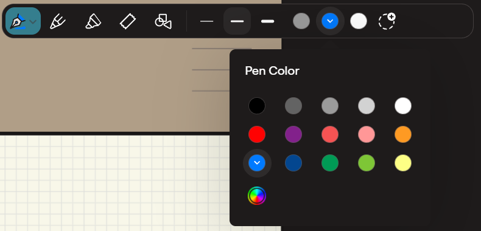

**GoodNotes (seen).**

- The selected swatch gets a dark ring and **a small ▾ inside it**. Tapping it again
  opens "Pen Color": 15 presets and a custom-colour button, with a pointer to the swatch
  and the current colour marked.
- There is no separate "more colours" control.

**GoodObsidian today.** A swatch tap only sets the colour
([toolbar.ts:724](../../src/view/toolbar.ts#L724)). The picker hangs off a separate
"More colours" button ([toolbar.ts:636](../../src/view/toolbar.ts#L636)). The pen icon
already shows the colour.

**On iPad in Obsidian: easy.** In the swatch click handler: if the colour is already
current, open the picker anchored on that swatch. Draw the ▾ in a contrasting colour, so
it stays visible on white and yellow.

---

## 10. Stroke width in millimetres

**GoodNotes (seen; narrow layout only, no screenshot).**

- The width button opens "Stroke Settings". It shows the width in **physical units
  ("0.90 mm")**, a reset ↺, three presets, a slider whose track is a **wedge** (thin to
  thick, so the slider pictures what it does), and "Stroke Type: Solid ›".
- In the wide layout the three presets sit directly in the options bar instead.

**GoodObsidian today.** A "More widths" list with no units
([toolbar.ts:627](../../src/view/toolbar.ts#L627)).

**On iPad in Obsidian: easy.**

- The page scale is already defined in millimetres: A4's 210 mm = 1024 px
  ([templates.ts:194](../../src/model/templates.ts#L194)), so mm = size / `PX_PER_MM`.
- Draw the wedge track with a CSS `clip-path: polygon(...)`.

---

## 11. Small ones

- **Copy link to this page.**
  - GoodNotes: the URL is always a link to the current page.
  - Obsidian equivalent: a command and a thumbnail "…" item, "Copy link to page",
    producing `[[Notebook.ink#page=3]]` via `app.fileManager.generateMarkdownLink`.
    GoodObsidian already _reads_ these links; it can't _make_ one yet.
- **Arrow keys.** GoodNotes: ↓/↑ scroll 150 px. GoodObsidian has PageUp/PageDown only
  ([ink-surface.ts:1470](../../src/view/ink-surface.ts#L1470)). This is for iPads with a
  Magic Keyboard.
- **Off-page notice.**
  - GoodNotes (seen): a stroke drawn past the page edge is dropped, and a toast
    "⚠ Content outside of the page" appears with **Undo**. The toast slides up from below:
    `translate(0,200%) scale(.6) opacity .5` → identity, 0.35 s,
    `cubic-bezier(0.21,1.02,0.73,1)`, a slight overshoot.
  - GoodObsidian keeps the stroke on the page it started on and says nothing
    ([ink-surface.ts:3244](../../src/view/ink-surface.ts#L3244)).
  - Whether to drop the stroke is a product call. **A notice with Undo** is the
    transferable part: build it as an in-view toast, since `Notice` can't hold a button
    well.

---

## 12. Frosted floating controls (optional)

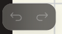

**GoodNotes (measured).**

- The undo/redo pill is `background: rgba(30,27,27,.25)`, `backdrop-filter: blur(30px)`,
  `border-radius: 16px`, `box-shadow: 0 8px 24px rgba(0,0,0,.08)`.
- The zoom pill and popovers follow the same recipe. The floating bars sit **over** the
  page instead of taking space from it.

**GoodObsidian today.** Opaque bars; the only `backdrop-filter` is on the sidebar's
Pages | Audio switch.

**On iPad in Obsidian: easy to write, uncertain cost.**

- WebKit supports `-webkit-backdrop-filter`.
- The cost is a re-blur on every frame in which the canvas underneath changes, which
  means during scrolling and inking. Limit it to the small pills, and compare the debug
  HUD's frame rate on the device with the blur on and off before keeping it.

---

## Already equal or better in GoodObsidian (left out on purpose)

- **Zoom:** pinch rubber-band and spring, at both limits, around the pinch centre
  (GoodNotes: ≈0.3 s near-linear spring-back; resistance grows the further you push). The
  zoom floor is fit-page, as it was for GoodNotes at iPad size. Only Ctrl+wheel lacks the
  stretch, which only matters on desktop.
- **Scrolling:** fling, rubber band and axis lock. GoodNotes web's mouse wheel is 1:1
  with no momentum and hard-stops at the ends.
- **Rendering:** blurry-then-sharp stand-ins while zooming. Movement already runs
  without stutter on the iPad (Joost, 2026-09-25), so GoodNotes' off-main-thread
  rendering isn't worth copying.
- **Draw-and-hold:** it fires at 500 ms. GoodNotes web needed **≈750–800 ms** and snaps
  while the pen is still down, as GoodObsidian does.
- **Pages:** Add page Before / After / Last page; recent templates; the current
  thumbnail outlined and kept in view.
- **Toolbars and menus:** the selection bar flips above/below and hides during drags; the
  pen icon shows the current colour; eraser sizes are drawn as footprints; eraser mode
  "Standard ▾".
- **Input:** predicted pen events (GoodNotes web doesn't use them); PageUp/PageDown.

## Method, and traps met on the way

- **GoodNotes web ignores synthetic input in places.** It uses synthetic
  `PointerEvent`/`WheelEvent`, but divides synthetic pen coordinates by
  `devicePixelRatio`. Its eraser ignored synthetic events, and synthetic touch did nothing
  on desktop Chrome, so finger physics couldn't be tested there.
- **Frozen frames.** Timing only means something while the tab is actually painted:
  - a background tab, a window on another virtual desktop, or a Claude browser pane not
    on screen all drop requestAnimationFrame to 0–1 fps;
  - check with a 1 s rAF count before every measurement.
  - Details are in a CodebaseButler note of 2026-09-24.
- **How the screenshots were made:** a PowerShell `CopyFromScreen` of the Chrome viewport
  only, never the tab strip. Edge-hugging controls were captured with the page
  temporarily scaled to 80% to clear the "Claude is controlling the screen" glow. That
  scaling breaks GoodNotes' canvas sizing until the next reload, so canvas-heavy shots
  were taken unscaled.
- **The raw measurement log** is [measurements.md](measurements.md); the numbers above
  are copied from it.
